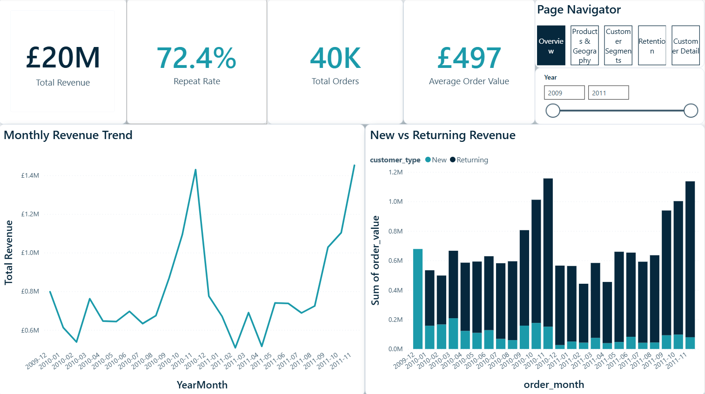
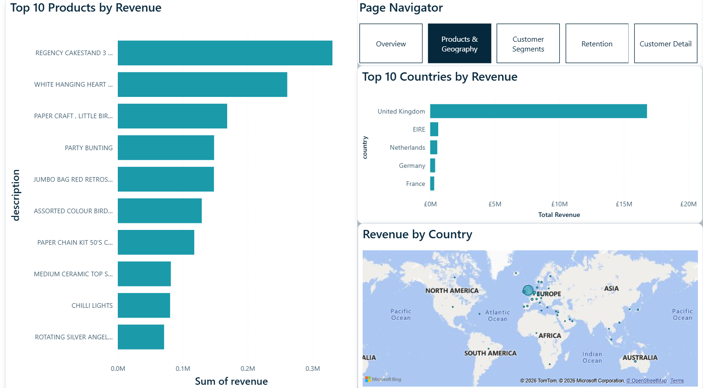
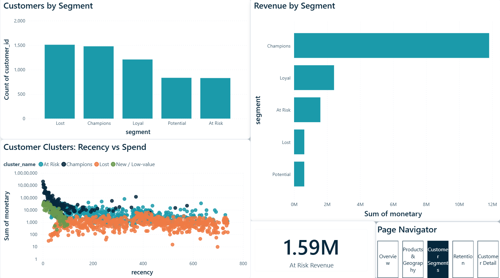
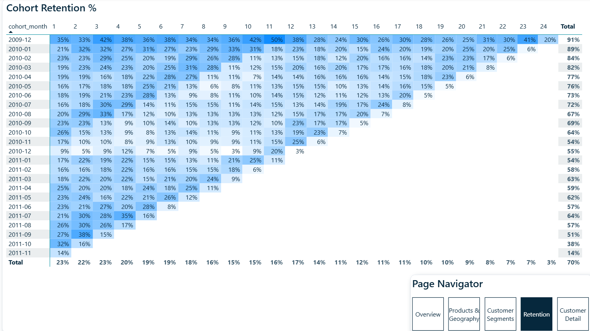

# RetailPulse — E-commerce Revenue & Customer Retention Analytics

An end-to-end analytics project on **1.07 million real e-commerce transactions** from a UK online gift
retailer (Dec 2009 – Dec 2011). It takes raw, messy data through cleaning, feature engineering,
exploratory analysis, SQL modelling, customer segmentation, and a four-page interactive Power BI
dashboard — with every decision documented and defensible.

> **Built as a Business Analyst / Data Analyst portfolio project.** The goal is to demonstrate the full
> analyst workflow, not a single skill: data-quality judgement, business framing, SQL, a simple
> explainable model, and a stakeholder-ready dashboard.

---

## Business questions

1. **Revenue health** — How is monthly revenue trending, and is growth driven by new or returning customers?
2. **Concentration risk** — Which products and countries drive revenue? Does the 80/20 rule hold?
3. **Retention** — What share of customers buy again, and how fast does each monthly cohort decay?
4. **Customer value** — Who are the high-value, loyal, and at-risk customers, and how much revenue is at risk?
5. **Leakage** — How much revenue is lost to cancellations, and is it concentrated?

## Headline findings

| Theme | Finding |
|---|---|
| **Revenue** | £19.64M net over 25 months; flat **+2.5% YoY**, **82.8% from returning customers** |
| **Concentration** | **UK = 85.5%** of revenue; **21% of products drive 80%** of revenue |
| **Retention** | **72.4% repeat rate**, but retention drops to ~20% after month 1, then plateaus |
| **Customer value** | **Top 20% of customers = 77%** of revenue; Champions ≈ 70% |
| **At risk** | **£1.6M–£2.9M** of revenue sits in the At-Risk segment — the win-back opportunity |
| **Leakage** | £716K lost to cancellations (3.6%), £168K of it a single reversed bulk order |

Full write-up with recommendations: **[`reports/insights.md`](reports/insights.md)**.

---

## Dashboard

Four report pages plus a customer-level drill-through, built in Power BI Desktop.

| Page | Focus |
|---|---|
| **Executive Overview** | KPIs, monthly revenue trend, new-vs-returning split |
| **Products & Geography** | Top products, revenue by country, geographic map |
| **Customer Segments** | RFM + K-Means segments, at-risk revenue, cluster scatter |
| **Retention** | Cohort retention heatmap (the centrepiece) |

<!-- Save your four page screenshots into dashboard/screenshots/ with these names -->





The `.pbix` file lives in [`dashboard/`](dashboard/).

---

## Tech stack

| Layer | Tools |
|---|---|
| Language / notebooks | Python 3.12, Jupyter |
| Wrangling | pandas, numpy, pyarrow |
| Visualisation | matplotlib, seaborn |
| Modelling | scikit-learn — `StandardScaler`, `KMeans` |
| Database | PostgreSQL 17 + pgAdmin |
| Dashboard | Power BI Desktop |
| Version control | Git + GitHub |

## Repository structure

```
retailpulse/
├── notebooks/
│   ├── 01_data_cleaning.ipynb          # profiling, dedup, filters, cancellation flag
│   ├── 02_feature_engineering.ipynb    # revenue, date parts, order/customer/cohort/RFM tables
│   ├── 03_eda.ipynb                    # the five business questions, 10 charts
│   └── 04_rfm_and_clustering.ipynb     # rule-based RFM + K-Means segmentation
├── sql/
│   ├── 00_schema.sql                   # keys + indexes
│   ├── 01_business_questions.sql       # combined reference
│   └── q1.sql … q6.sql                 # one runnable file per question
├── scripts/
│   ├── load_to_postgres.py             # load the 4 feature tables into PostgreSQL
│   ├── run_sql.py                      # run a .sql file (psql-free)
│   └── export_for_powerbi.py           # curated CSVs for the dashboard
├── dashboard/
│   ├── RetailPulse.pbix                # the Power BI report
│   ├── RetailPulse-theme.json          # custom theme
│   └── screenshots/                    # page images used in this README
├── reports/
│   └── insights.md                     # findings & recommendations
├── requirements.txt
└── README.md
```

---

## Reproduce it

Data files are **not committed** (90 MB raw / regenerable processed) — download the dataset first.

**1. Get the data**

- Source: [UCI Online Retail II](https://archive.ics.uci.edu/dataset/502/online+retail+ii)
  (Kaggle mirror: `mashlyn/online-retail-ii-uci`).
- Place the merged CSV at `data/raw/online_retail_II.csv`.

**2. Set up Python**

```bash
pip install -r requirements.txt
```

**3. Run the notebooks** in order (`01` → `04`). Notebook 02 writes the processed Parquet tables that
the later notebooks and scripts consume.

**4. (Optional) SQL layer** — with PostgreSQL running:

```bash
python scripts/load_to_postgres.py     # loads the 4 tables (prompts for password)
python scripts/run_sql.py sql/q1.sql    # run any business question
```

**5. Dashboard** — `python scripts/export_for_powerbi.py` writes the curated CSVs, then open
`dashboard/RetailPulse.pbix` in Power BI Desktop.

---

## Design principles

- **Every transformation has a documented reason and a stated trade-off** — see the notebooks and
  `PROJECT.md` decision log. Missing customer IDs are kept in the transaction table but excluded from
  customer-level analysis; cancellations are flagged, not deleted; the recency snapshot is fixed to the
  data, never `today()`.
- **The modelling stops at one simple, explainable model** (K-Means on log-transformed RFM) — code you
  can't defend out loud is a liability, not an asset.
- **Grain is respected throughout** — orders are counted from distinct invoices, never row counts.
